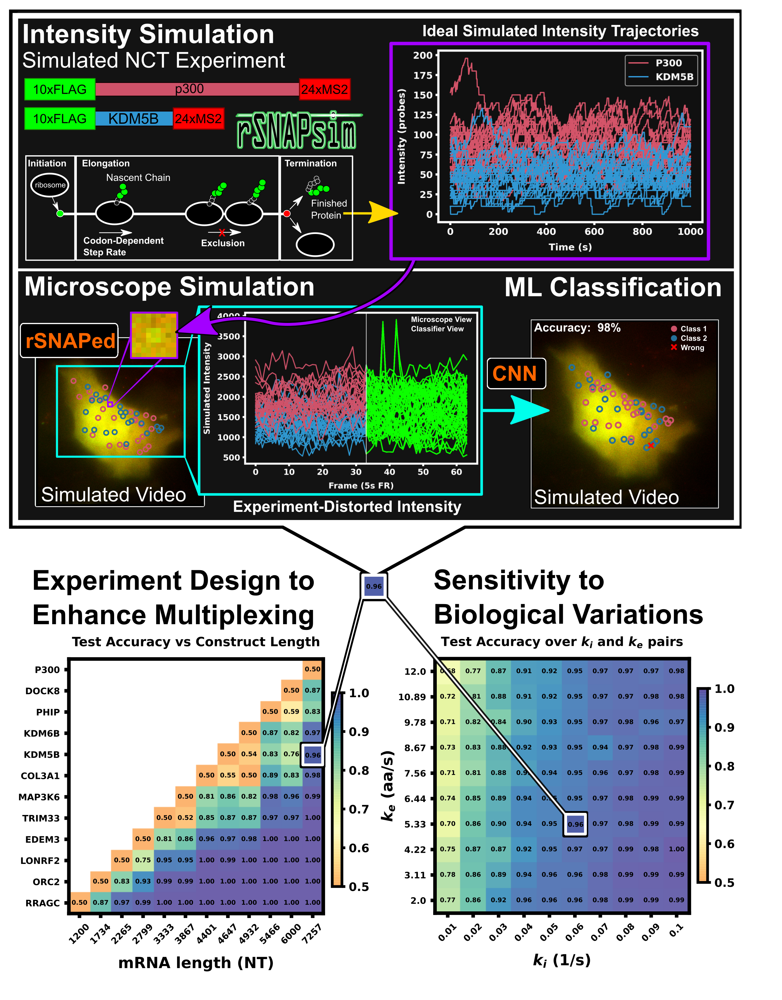

 
Using mechanistic models and machine learning to design single-color multiplexed nascent chain tracking experiments 
 

William S. Raymond1, Sadaf Ghaffari2, Luis U. Aguilera3, Eric Ron1, Tatsuya Morisaki4, Zachary R. Fox1,5, Michael P. May1, Timothy J. Stasevich4,6* and Brian Munsky1,3* 
 [1] School of Biomedical Engineering, Colorado State University, Fort Collins, CO, United States
 [2] Department of Computer Science, Colorado State University, Fort Collins, CO, United States 
 [3] Department of Chemical and Biological Engineering, Colorado State University, Fort Collins, CO, United States 
 [4] Department of Biochemistry and Molecular Biology, Colorado State University, Fort Collins, CO, United States 
 [5] Computational Sciences and Engineering Division, Oak Ridge National Laboratory, Oak Ridge, TN, United States
 [6] World Research Hub Initiative and Cell Biology Unit, Institute of Innovative Research, Tokyo Institute of Technology, Yokohama, Japan

 Link to the paper: <a href="https://www.frontiersin.org/articles/10.3389/fcell.2023.1151318/full">     </a>
 

 
  <h3 style="color: white;">
    Key Takeaway:
  </h3>
  <h4 style="color: white;">
  By combining <b>mechanistic models</b>, <b>realistic</b>, <b>microscope simulations</b>, and <b>machine learning</b>, we can <b>optimize experiment designs</b> and <b>create new capabilities</b> for single mRNA <b>NCT experiments</b>.
  </h4>

 
  <h2 style="padding: 10px">
    Graphical Abstract:
  </h2>
  

 
  <h2 style="padding: 10px">
    Abstract:
  </h2>

mRNA translation is the ubiquitous cellular process of reading messenger-RNA strands into functional proteins. Over the past decade, large strides in microscopy techniques have allowed observation of mRNA translation at a single-molecule resolution for self-consistent time-series measurements in live cells. Dubbed Nascent chain tracking (NCT), these methods have explored many temporal dynamics in mRNA translation uncaptured by other experimental methods such as ribosomal profiling, smFISH, pSILAC, BONCAT, or FUNCAT-PLA. However, NCT is currently restricted to the observation of one or two mRNA species at a time due to limits in the number of resolvable fluorescent tags. In this work, we propose a hybrid computational pipeline, where detailed mechanistic simulations produce realistic NCT videos, and machine learning is used to assess potential experimental designs for their ability to resolve multiple mRNA species using a single fluorescent color for all species. Our simulation results show that with careful application this hybrid design strategy could in principle be used to extend the number of mRNA species that could be watched simultaneously within the same cell. We present a simulated example NCT experiment with seven different mRNA species within the same simulated cell and use our ML labeling to identify these spots with 90% accuracy using only two distinct fluorescent tags. We conclude that the proposed extension to the NCT color palette should allow experimentalists to access a plethora of new experimental design possibilities, especially for cell Signaling applications requiring simultaneous study of multiple mRNAs.

 

 
 Back to publications &nbsp;   
 

 
 

