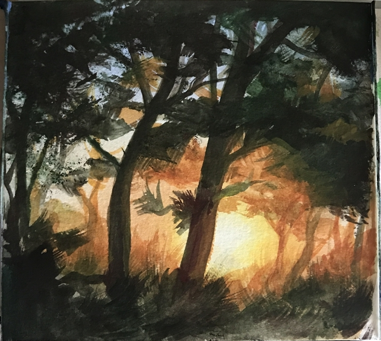
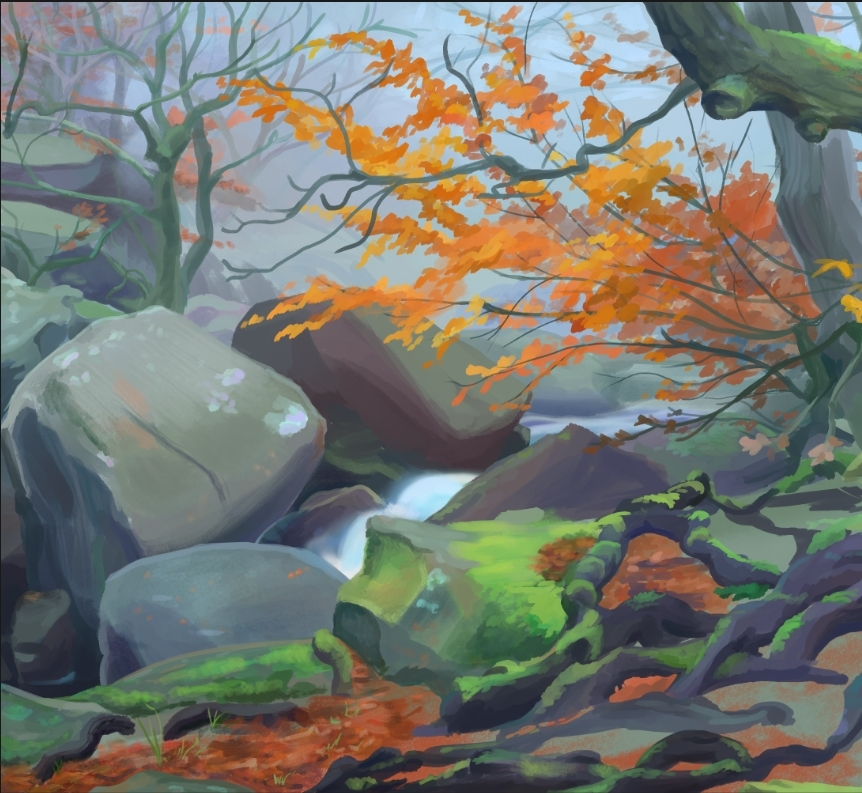
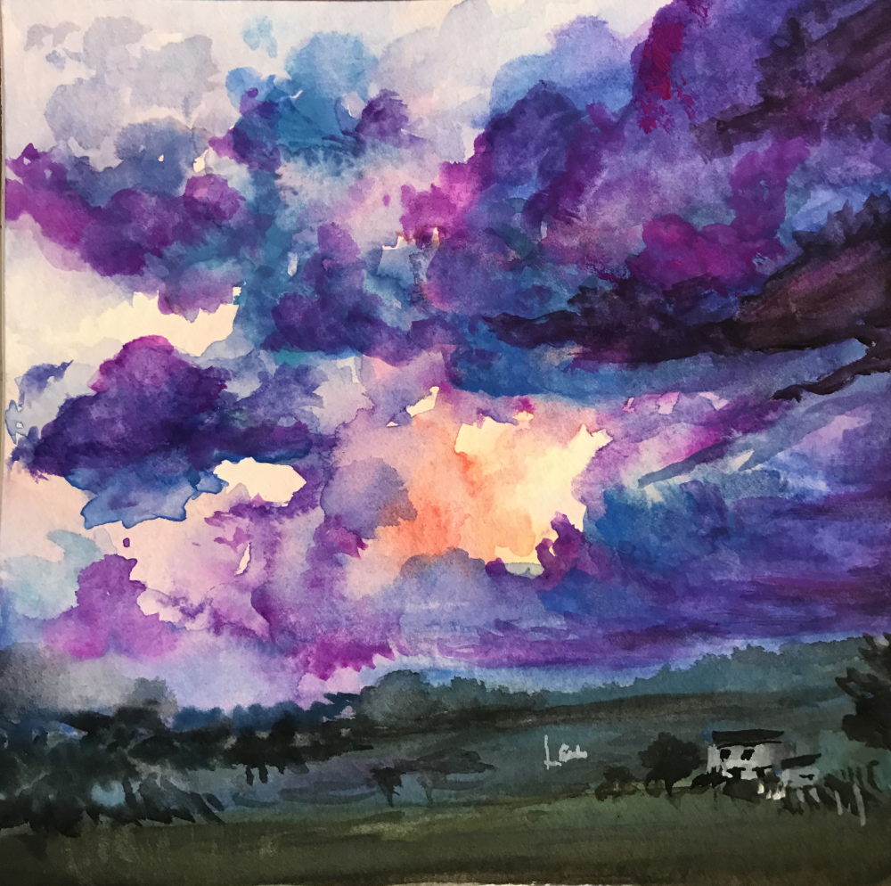
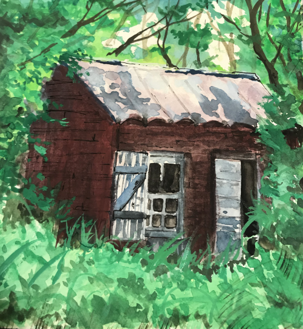
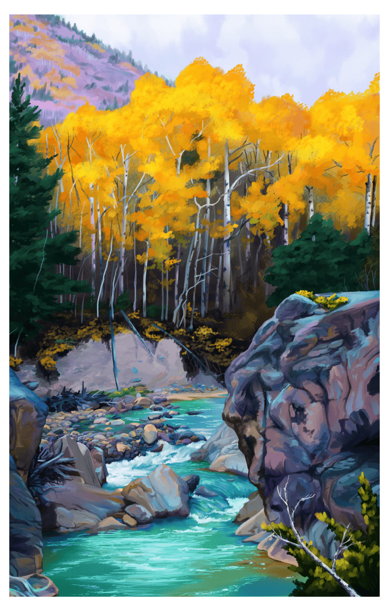
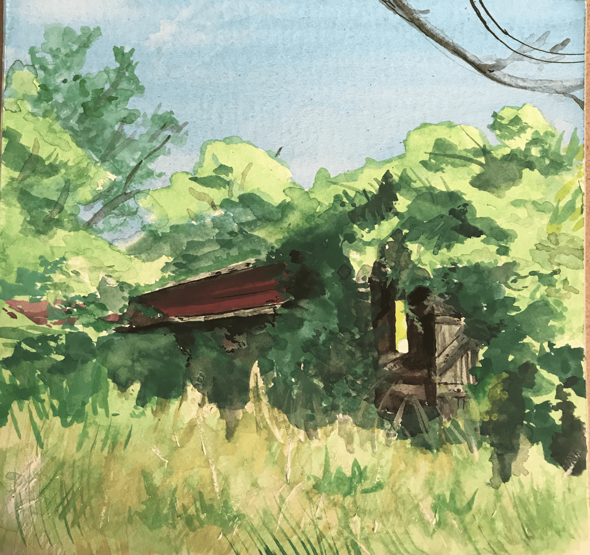
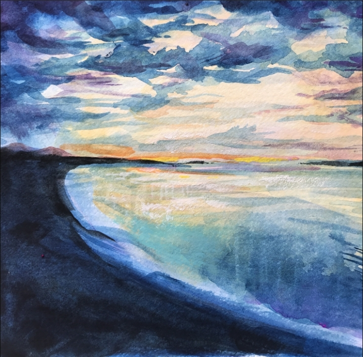
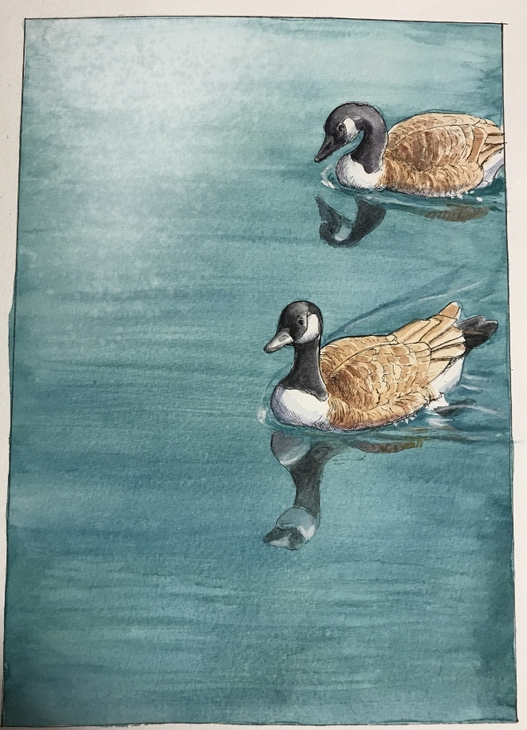
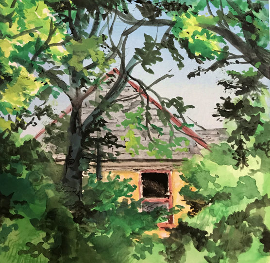

During covid I picked up painting as a hobby, mainly watercolor but also some digital as well as acrylic. Below is a couple example paintings, I mainly followed books with no formal training so quality is suspect.

   

         
   

   

      
   

   

      
   

   

      
   

   

      
   

   

      
   

   

      
   

   

      
   

   

      
   

   

      
   

   

      
   

   

      
   

