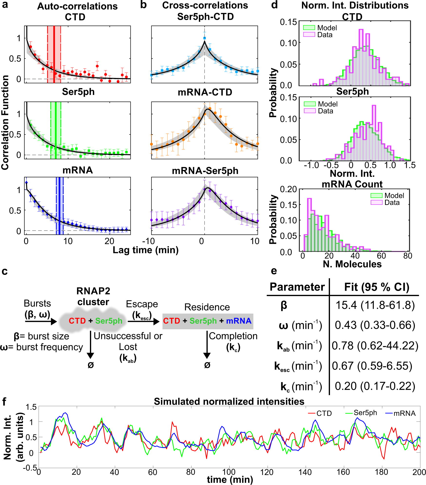

    
  

    Live-cell imaging reveals the spatiotemporal organization of endogenous RNA polymerase II phosphorylation at a single gene
  
 

  
 
    Linda S. Forero-Quintero, William Raymond, Tetsuya Handa, Matthew N. Saxton, Tatsuya Morisaki, Tatsuya Morisaki,  Hiroshi Kimura, Edouard Bertrand, Brian Munsky, and Timothy J. Stasevich 
  

 Link to the paper: <a href="https://www.nature.com/articles/s41467-021-23417-0">     </a>
 

 

  <h3 style="color: white;">
    Key Takeaway:
  </h3>
  <h4 style="color: white;">
  The entirety of DNA transcription can be interrogated at a single transcription site with careful fluosecence microscopy experimental design. For the first time, recruitment, initiation, and elongation can be watched in a live cell simultaneously. Computational models determine that 5 to 40 RNAP2 cluster around an HIV promotor of a single copy gene during a typical transcriptional burst, with most phosphorylated at Serine 5 within 6 seconds of arrival and roughly half escaping the promoter in ~1.5 minutes. 
  </h4>

 

I contributed significantly to the computational modeling portion of the paper, performing model selection of several different models (supplemental information) with the help of my PI, Dr. Brian Munsky.

  <h3 style="padding-bottom: 10px; padding-top: 10px; margin 5px;">
    Key Figure:
  </h3>
  

   <b> a), b) </b> Measured and modeled (a) auto-correlation functions AC(τ)/G(0) for each signal: CTD-RNAP2 (red circles), Ser5ph-RNAP2 (green squares), and mRNA (blue diamonds). Dwell time is defined as the time at which the autocovariance dropped below 20% of its zero-lag value (vertical full lines). Dwell time uncertainty is estimated from the model using the standard deviation from 400 simulated data sets, each with 20 cells over 200 min with 1 min simulation resolution (vertical dashed lines). b Cross-correlation function CC(τ)/G(0) between signal pairs: Ser5ph-RNAP2 and CTD-RNAP2 (cyan squares), mRNA and CTD-RNAP2 (orange circles), and mRNA and Ser5ph-RNAP2 (purple diamonds) at the transcription site. Model Maximum Likelihood Estimate (MLE) fit in black and sampled uncertainty in gray. <b>c)</b> A simple model to capture RNAP2 fluctuation dynamics at the HIV-1 reporter gene. RNAP2 enters the transcription cluster with an average geometric burst with average burst size, β, and burst frequency, ω. Phosphorylation of Serine 5 is assumed to be fast (<<1 min) and/or the RNAP2 enters in a pre-phosphorylated form. RNAP2 can be lost from the cluster with rate kab or escape with rate kesc. RNAP2 completes transcription with rate kc. d Probability distributions for CTD-RNAP2 and Ser5ph-RNAP2 (arbitrary units of fluorescence), and mRNA (units of mature mRNA) for experimental data (purple) and model MLE predictions (green). <b>e)</b> MLE parameters and 95% confidence interval (CI) range. Statistics presented for the data are the sample means ± S.E.M. n=number of cells/number of independent experiments (20/8). <b>f)</b> Simulated trajectory (with shot noise equal to that of experiments) of CTD-RNAP2 (red), Ser5ph-RNAP2 (green), and mRNA (blue) intensities normalized to have a 95 percentile of unity. 

 
  <h3 style="padding-top: 10px;">
    Abstract:
  </h3>

The carboxyl-terminal domain of RNA polymerase II (RNAP2) is phosphorylated during transcription in eukaryotic cells. While residue-specific phosphorylation has been mapped with exquisite spatial resolution along the 1D genome in a population of fixed cells using immunoprecipitation-based assays, the timing, kinetics, and spatial organization of phosphorylation along a single-copy gene have not yet been measured in living cells. Here, we achieve this by combining multi-color, single-molecule microscopy with fluorescent antibody-based probes that specifically bind to different phosphorylated forms of endogenous RNAP2 in living cells. Applying this methodology to a single-copy HIV-1 reporter gene provides live-cell evidence for heterogeneity in the distribution of RNAP2 along the length of the gene as well as Serine 5 phosphorylated RNAP2 clusters that remain separated in both space and time from nascent mRNA synthesis. Computational models determine that 5 to 40 RNAP2 cluster around the promoter during a typical transcriptional burst, with most phosphorylated at Serine 5 within 6 seconds of arrival and roughly half escaping the promoter in ~1.5 minutes. Taken together, our data provide live-cell support for the notion of efficient transcription clusters that transiently form around promoters and contain high concentrations of RNAP2 phosphorylated at Serine 5.

 

 
 Back to publications &nbsp;   
 

 
 

