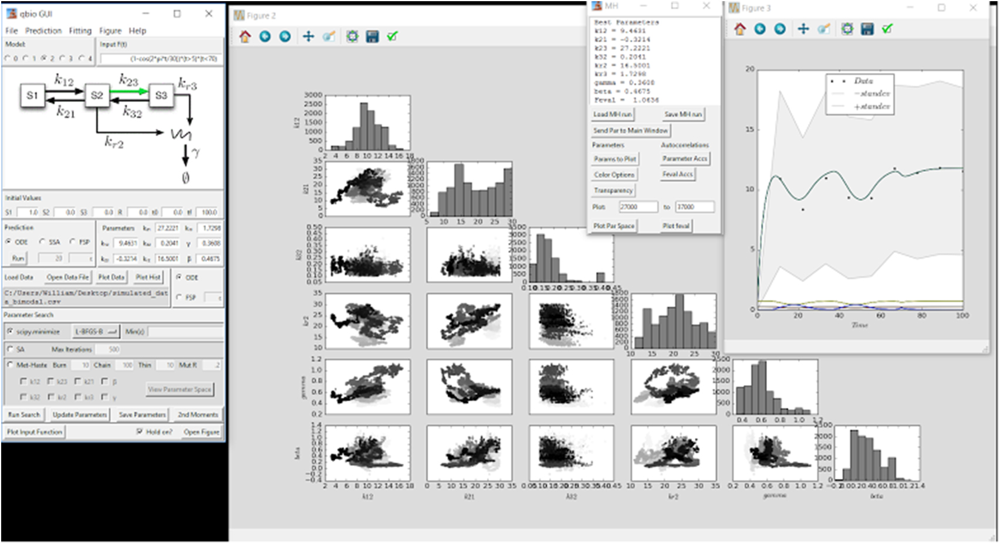

    
  

    Identification of gene regulation models from single-cell data
  
 

  
 
    Lisa Weber,  William Raymond, Brian Munsky
  

 Link to the paper: <a href="https://iopscience.iop.org/article/10.1088/1478-3975/aabc31">     </a>
 

 

  <h3 style="color: white;">
    Key Takeaway:
  </h3>
  <h4 style="color: white;">
   A primer on using ODE analyses, stochastic simulations, and metropolis-hastings for fitting bursting gene models.
  </h4>

 

I provided a simple tkinter GUI for the models described in this paper.

  <h3 style="padding-bottom: 10px; padding-top: 10px; margin 5px;">
    Key Figure:
  </h3>
  

   Screenshot of the GUI made for the paper. 

 
  <h3 style="padding-top: 10px;">
    Abstract:
  </h3>

In quantitative analyses of biological processes, one may use many different scales of models (e.g. spatial or non-spatial, deterministic or stochastic, time-varying or at steady-state) or many different approaches to match models to experimental data (e.g. model fitting or parameter uncertainty/sloppiness quantification with different experiment designs). These different analyses can lead to surprisingly different results, even when applied to the same data and the same model. We use a simplified gene regulation model to illustrate many of these concerns, especially for ODE analyses of deterministic processes, chemical master equation and finite state projection analyses of heterogeneous processes, and stochastic simulations. For each analysis, we employ Matlab and Python software to consider a time-dependent input signal (e.g. a kinase nuclear translocation) and several model hypotheses, along with simulated single-cell data. We illustrate different approaches (e.g. deterministic and stochastic) to identify the mechanisms and parameters of the same model from the same simulated data. For each approach, we explore how uncertainty in parameter space varies with respect to the chosen analysis approach or specific experiment design. We conclude with a discussion of how our simulated results relate to the integration of experimental and computational investigations to explore signal-activated gene expression models in yeast (Neuert et al 2013 Science 339 584–7) and human cells (Senecal et al 2014 Cell Rep. 8 75–83)5.

 

 
 Back to publications &nbsp;   
 

 
 

