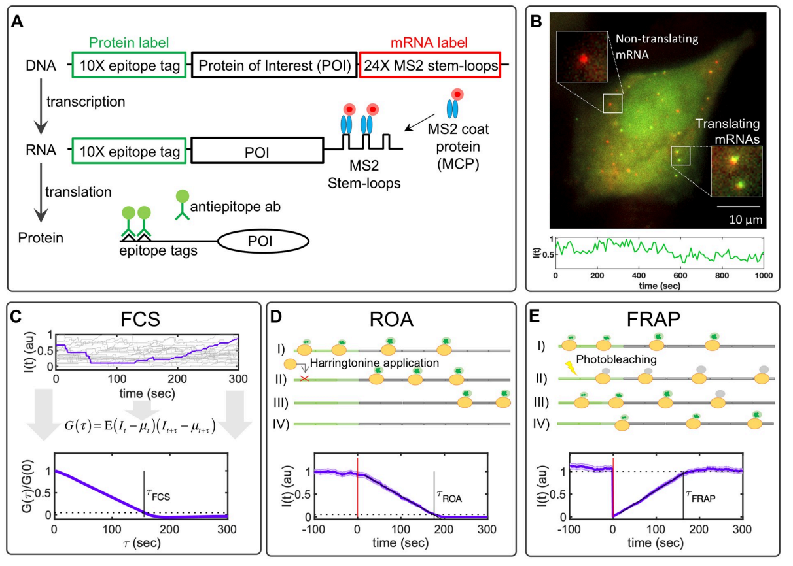

    
  

    Computational design and interpretation of single RNA translation experiments
  
 

  
 
    Luis U. Aguilera,  William Raymond, Zachary R. Fox, Michael May, Elliot Djokic,Tatsuya Morisaki, Timothy J. Stasevich, Brian Munsky
  

 Link to the paper: <a href="https://journals.plos.org/ploscompbiol/article/comments?id=10.1371/journal.pcbi.1007425">     </a>
 

 

  <h3 style="color: white;">
    Key Takeaway:
  </h3>
  <h4 style="color: white;">
   Nascent chain tracking experiments can be fit with a codon dependent TASEP model. Using this model we simulate and evaluate three techniques for measuring elongation rates, finding that Fluorescent Correlation Spectroscopy (FCS) gives the best measurement of the experimental techniques. We provide this mRNA translation model in the Python package, rSNAPsim.
  </h4>

 

I contributed significantly to the computational modeling portion of the paper, developing the initial version of the rSNAPsim in Python, and generating figures using the mRNA model.

  <h3 style="padding-bottom: 10px; padding-top: 10px; margin 5px;">
    Key Figure:
  </h3>
  

   A) Imaging single-molecule translation dynamics is achieved by the measurement of fluorescence spots that are produced when nascent proteins display epitopes that are recognized by antibody fragments bound to fluorescent probes. The gene construct encodes a 10X FLAG SM tag followed by a protein of interest (POI) and the 24X MS2 tag in the 3’ UTR region. B) Microscopy image showing translation at single-molecule resolution; red spots represent single mRNA, and green spots represent nascent proteins. Below is a representative trace showing the intensity fluctuation dynamics of a single-transcript translating FLAG-10X-KDM5B. C) Simulated time courses representing the characteristic single-molecule fluctuation dynamics. A representative trace is selected and highlighted. At the bottom of the figure is given the normalized auto-covariance function (G(τ)) calculated from simulated time courses. The time at which G(τ) hits zero represents the dwell-time (τFCS). D) Harringtonine inhibits the translation initiation step by binding to the ribosomal 60S subunit. The plot shows the average fluorescence after Harringtonine treatment. Without new initiation events, the fluctuations diminish causing the intensity to drop to zero at time τROA. E) FRAP causes a rapid drop in the fluorescent intensity and a subsequent recovery that is proportional to the time needed by ribosomes to produce new nascent proteins with non-photobleached probes. The bottom plot shows the temporal dynamics of FRAP, where it can be observed by the abrupt decrease in intensity and a recovery time (τFRAP) correlated with the gene length. All simulations correspond to KDM5B for 100 spots and a frame rate of 1 FPS. Error bars represent the standard error of the mean.  

 
  <h3 style="padding-top: 10px;">
    Abstract:
  </h3>

Advances in fluorescence microscopy have introduced new assays to quantify live-cell translation dynamics at single-RNA resolution. We introduce a detailed, yet efficient sequence-based stochastic model that generates realistic synthetic data for several such assays, including Fluorescence Correlation Spectroscopy (FCS), ribosome Run-Off Assays (ROA) after Harringtonine application, and Fluorescence Recovery After Photobleaching (FRAP). We simulate these experiments under multiple imaging conditions and for thousands of human genes, and we evaluate through simulations which experiments are most likely to provide accurate estimates of elongation kinetics. Finding that FCS analyses are optimal for both short and long length genes, we integrate our model with experimental FCS data to capture the nascent protein statistics and temporal dynamics for three human genes: KDM5B, β-actin, and H2B. Finally, we introduce a new open-source software package, RNA Sequence to NAscent Protein Simulator (rSNAPsim), to easily simulate the single-molecule translation dynamics of any gene sequence for any of these assays and for different assumptions regarding synonymous codon usage, tRNA level modifications, or ribosome pauses. rSNAPsim is implemented in Python and is available at: https://github.com/MunskyGroup/rSNAPsim.git.

 

 
 Back to publications &nbsp;   
 

 
 

