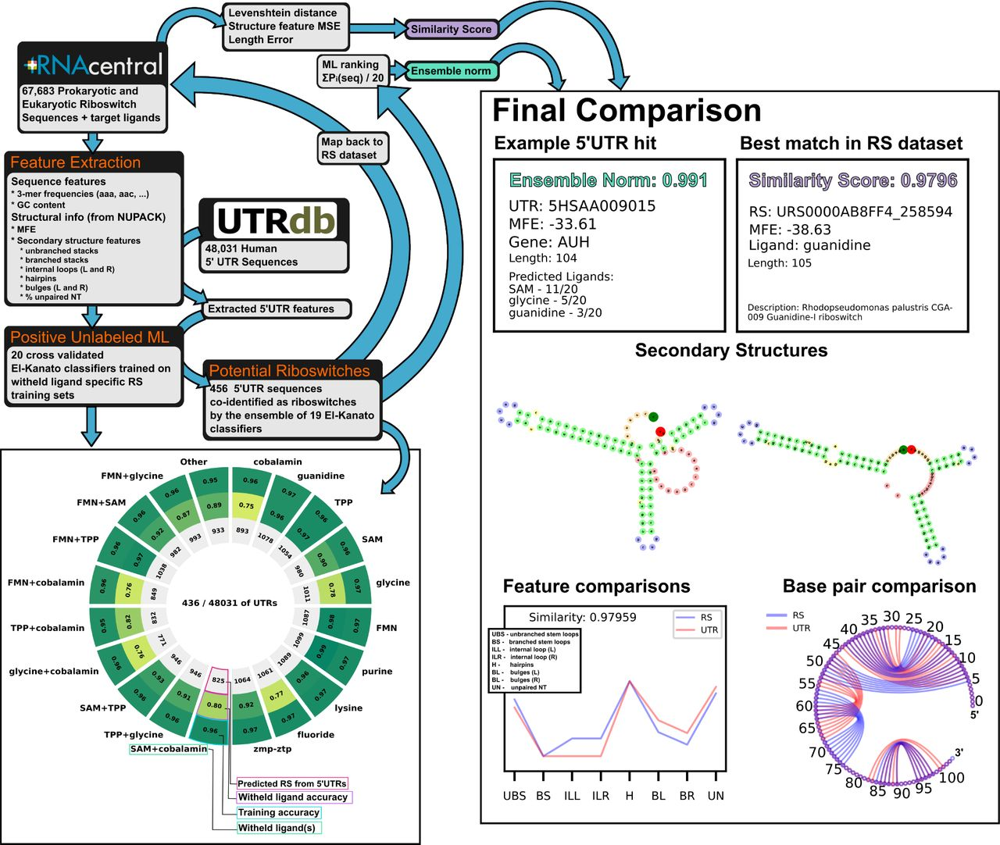

    
  

    Identification of Potential Riboswitch Elements in Homo Sapiens mRNA 5'UTR Sequences Using Positive-Unlabeled Machine Learning
  
 

  
 
     William Raymond, Jacob DeRoo, Dr Brian Munsky
  

 Link to the paper: <a href="https://www.biorxiv.org/content/10.1101/2023.11.23.568398v1.full.pdf6">     </a>
 

 

  <h3 style="color: white;">
    Key Takeaway:
  </h3>
  <h4 style="color: white;">
    436 potential riboswitch elements detected for future experimental validation with a cross-validated positive unlabeled machine learning ensemble trained on known riboswitches.
  </h4>

 

I provided a simple tkinter GUI for the models described in this paper.

  <h3 style="padding-bottom: 10px; padding-top: 10px; margin 5px;">
    Key Figure:
  </h3>
  

   Graphical Abstract 

 
  <h3 style="padding-top: 10px;">
    Abstract:
  </h3>

Riboswitches are a class of noncoding RNA structures that interact with target ligands to cause a conformational change that can then execute some regulatory purpose within the cell. Riboswitches are ubiquitous and well characterized in bacteria and prokaryotes, with additional examples also being found in fungi, plants, and yeast. To date, no purely RNA-small molecule riboswitch has been discovered in Homo Sapiens. Several analogous riboswitch-like mechanisms have been described within the H. Sapiens translatome within the past decade, prompting the question: Is there a H. Sapiens riboswitch dependent on only small molecule ligands? In this work, we set out to train positive unlabeled machine learning classifiers on known riboswitch sequences and apply the classifiers to H. Sapiens mRNA 5’UTR sequences found in the 5’UTR database, UTRdb, in the hope of identifying a set of mRNAs to investigate for riboswitch functionality. 67,683 riboswitch sequences were obtained from RNAcentral and sorted for ligand type and used as positive examples and 48,031 5’UTR sequences were used as unlabeled, unknown examples. Positive examples were sorted by lig- and, and 20 positive-unlabeled classifiers were trained on sequence and secondary structure features while withholding one or two ligand classes. Cross validation was then performed on the withheld ligand sets to obtain a validation accuracy range of 75%-99%. The joint sets of 5’UTRs identified as potential riboswitches by the 20 classifiers were then analyzed. 15333 sequences were identified as a riboswitch by one or more classifier(s) and 436 of the H. Sapiens 5’UTRs were labeled as harboring potential riboswitch elements by all 20 classifiers. These 436 sequences were mapped back to the most similar riboswitches within the positive data and examined. An online database of identified and ranked 5’UTRs, their features, and their most similar matches to known riboswitches, is provided to guide future experimental efforts to identify H. Sapiens riboswitches.

 

 
 Back to publications &nbsp;   
 

 
 

